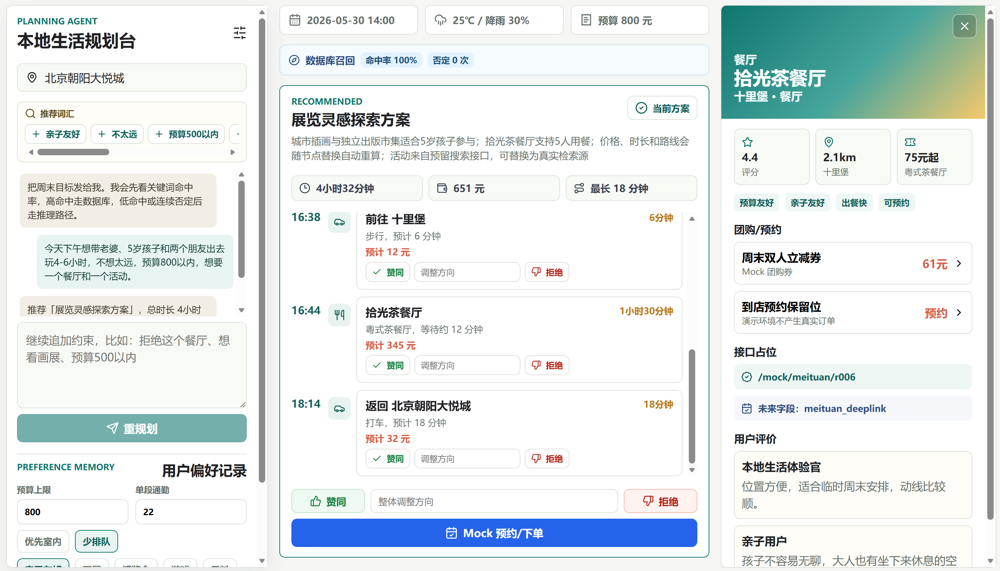
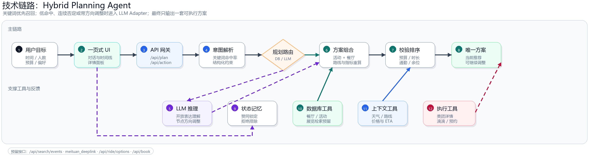
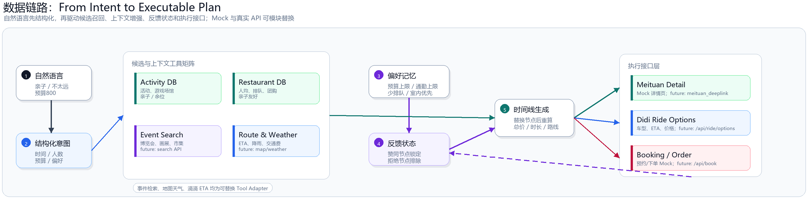

# Weekend Agent 技术文档

美团首届黑客松赛题 06「本地探索：周末闲时活动规划」Demo。

Weekend Agent 面向“周末临时出门”的本地生活场景。用户只需要输入一句自然语言目标，系统即可生成一套包含活动、餐厅、路线、预算和预约动作的可执行方案，并支持对整套方案或单个节点持续微调。

本项目不是静态搜索列表，而是一个可执行 Planning Agent：它会把模糊需求拆成结构化约束，调用本地生活工具，校验预算、路线、天气、余位和亲子适配，再输出唯一推荐方案。

## Demo 界面



## 1. 系统架构

项目采用前后端分离架构：

```text
React + Vite Frontend
  -> FastAPI Backend
  -> Planning Agent
  -> Mock Tool Adapters
  -> Validator & Replanner
  -> Meituan / Didi / Search / Booking interface placeholders
```

核心模块：

| 模块 | 作用 |
| --- | --- |
| `frontend/` | 一页式 Demo UI，负责自然语言输入、推荐方案、节点反馈、详情面板和 Mock 预约 |
| `backend/main.py` | FastAPI 入口，提供 `/api/plan`、`/api/action`、`/api/poi/{id}`、`/api/book` 等接口 |
| `backend/agent/parser.py` | 规则版意图解析器，抽取时间、人数、预算、距离、天气、餐饮和活动偏好 |
| `backend/agent/planner.py` | Planning Core，负责任务路由、候选召回、节点替换、整套方案重规划 |
| `backend/agent/validator.py` | 约束校验器，检查预算、时长、通勤、亲子适配、天气和余位 |
| `backend/tools/` | Mock Tool Adapters，模拟活动、餐厅、展览、路线、天气、POI 详情和预约工具 |
| `backend/data/` | Demo 数据库，包含活动、餐厅、展览、路线和天气 Mock 数据 |

## 2. 技术链路



系统采用 Client-Agent-Reasoning-Tools 四层结构。

用户在 React 一页式界面输入目标后，请求进入 FastAPI Gateway。后端首先进行意图解析和关键词命中率判断，然后由 Planner Router 决定走数据库召回还是 LLM 推理。无论走哪条路径，最终都会进入 Plan Composer 和 Validator & Ranker，输出唯一可执行方案。

首次规划链路：

```text
POST /api/plan
-> parse_user_intent
-> keyword_match
-> retrieval_mode
-> search_activities / search_live_events / search_restaurants
-> get_weather / get_route_time
-> validate_plan
-> rank
-> recommended_plan
```

节点修改链路：

```text
POST /api/action reject_item
-> 更新 approved / rejected 状态
-> build_item_adjustment_directive
-> llm_node_adjustment_adapter
-> 替换目标节点
-> 重算价格 / 时间 / 路线
```

整套方案拒绝链路：

```text
POST /api/action reject_plan
-> 当前 activity::restaurant 组合加入 rejected_plan_keys
-> 优先在数据库内切换下一套方案
-> 连续拒绝或带方向时切换 LLM 推理重排
-> 输出新的唯一方案
```

## 3. Planning 策略

系统采用“关键词优先、数据库召回、必要时 LLM 推理”的混合 Planning 策略。

用户输入自然语言后，Parser 首先抽取人数、孩子年龄、预算、时间、距离、天气、餐饮偏好和活动偏好，并计算关键词命中率。当关键词命中率较高时，系统优先走数据库召回；当用户表达比较开放、关键词命中率较低，或用户连续否定当前方案时，系统切换到 LLM Adapter 进行推理和重排。

| 用户场景 | 路由策略 | 规划动作 |
| --- | --- | --- |
| 关键词命中率 `>= 0.55` | `database` | 从本地 POI、活动、餐厅库召回，按预算、距离、亲子友好、排队情况、余位等维度打分 |
| 关键词命中率 `< 0.55` | `llm_reasoning` | 将开放自然语言转成结构化约束，再参与候选重排 |
| 整套方案连续拒绝 `>= 2` 次 | `llm_reasoning` | 跳出原有候选组合，重新生成新的活动-餐厅-路线结构 |
| 用户输入整体调整方向 | `llm_reasoning` | 例如“更便宜”“减少打车”“更适合孩子”，重新计算总价、时长和路线 |
| 用户输入单节点调整方向 | `llm_node_adjustment_adapter` | 只替换目标节点，保留已赞同节点，并重新计算全局指标 |

系统一次只返回一套方案。赞同节点会在后续重规划中锁定保留，拒绝节点进入排除集。如果用户误点，赞同和拒绝状态可以互相覆盖，避免状态不可逆。

## 4. 数据链路与工具接口



工具调用采用统一 Tool Adapter 约定。每个候选都返回统一字段：

```text
id
name
type
location
duration
cost
tags
reservation
mock_url
```

Planning Core 只依赖这些统一字段，而不依赖具体平台。因此餐厅数据可以从 Mock JSON 替换到美团 POI，打车价格可以从 Mock 价格替换到滴滴车型报价，展览活动可以从静态 JSON 替换到实时搜索 API，而上层计划生成逻辑保持不变。

预留接口：

| 接口 | 当前实现 | 后续可替换能力 |
| --- | --- | --- |
| `/api/search/events` | Mock 展览/博览会数据 | 接入真实搜索引擎或活动检索 API |
| `mock_meituan_url` | 类美团详情页 | 替换为 `meituan_deeplink` |
| `/api/ride/options` | Mock 打车车型和价格 | 接入滴滴车型、ETA、价格接口 |
| `/api/book` | Mock 预约/下单 | 接入美团预约、团购或订单 API |

数据状态分为三类：

- 短期会话状态：记录当前方案、已赞同节点、已拒绝节点和拒绝次数。
- 用户偏好记忆：记录预算上限、通勤上限、室内优先、少排队、孩子友好等偏好。
- 外部执行状态：记录详情页跳转、打车车型选择和预约结果。

## 5. 异常处理机制

接口异常由 FastAPI 统一处理。`session_id` 或 `plan_id` 不存在返回 `404`，不支持的 `action` 返回 `400`。前端请求失败时不会清空当前方案，而是保留已有结果并提示用户重试。

规划异常采用“校验不断流，排序来兜底”的策略。`validate_plan` 会对每套方案输出预算、时长、通勤、天气、亲子适配和余位检查结果。有效方案优先展示，有问题方案扣分降级。如果所有候选都被过滤，系统启用 `fallback_candidates`，避免无结果页面。

交互异常采用状态覆盖和防连点机制。赞同与拒绝互斥：用户赞同某个节点时，会移除该节点的拒绝记录；用户拒绝某个节点时，会移除该节点的赞同记录。请求进行中，前端会禁用按钮和输入框，避免重复点击导致状态乱序。

外部工具异常采用降级策略。天气接口失败时使用默认天气标签；路线接口失败时使用保守 ETA；活动检索失败时退回本地活动库；预约失败时保留当前方案，但提示用户需要人工确认。LLM 接口未配置或调用失败时，系统回到规则版规划，不影响完整 Demo 演示。


## 6. 演示脚本

首次输入：

```text
今天下午想带老婆、5岁孩子和两个朋友出去玩4-6小时，不想太远，预算800以内，帮我安排一下。
```

可以继续追加：

```text
太远了，换近一点
下雨了，改室内
预算500以内
换成日料餐厅
想看画展或者博览会
```

可以点击体验：

```text
赞同方案
拒绝方案
单个节点赞同/拒绝
活动或餐厅详情
打车车型选择
Mock 预约/下单
```
